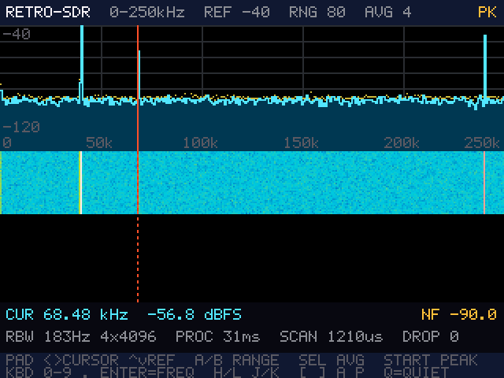

# rp2040-retro-sdr

RP2040 掌機上的 LF 直接取樣 SDR：0–250 kHz 的頻譜與瀑布圖，目標是喇叭出聲、
解 BPC／JJY 授時碼。

[rp2040-retro-handheld](https://github.com/pondahai/rp2040-retro-handheld)
生態系的一員。主板不用改，只在 GPIO 26 加 3 顆被動元件，鍵盤照常能用。
完整設計見 [docs/DESIGN.md](docs/DESIGN.md)。

## 目前進度

| | 內容 | 狀態 |
| :--- | :--- | :--- |
| **M1** | ADC 取樣、寬頻 FFT、頻譜＋瀑布圖、鍵盤分時 | **程式完成、PC 測試通過；尚未上機** |
| M2 | 窄頻 DDC、CW／AM 解調、喇叭出聲 | |
| M3 | BPC／JJY 解碼 | |
| M4 | SD 卡錄音、預設清單 | |
| M5 | 封面、偏移編譯、收進 bundle | |

## 硬體：唯一要加的東西

```
3V3 ──[330k]──┬──[47k]── GND        偏壓 ≈ 0.41 V
              │
天線 ──||──────┴── GPIO 26（ADC0 ／ 74HC CLOCK）
      1nF
```

天線是 3–10 m 的電線，越長越好。為什麼偏壓是 0.41 V 而不是中點，見 DESIGN.md §1.1。

## 畫面與按鍵（M1）



上方是頻譜（青色＝平均、黃點＝峰值保持、紅線＝游標），中間是瀑布圖，
下方是游標讀數與雜訊底線（NF）。上圖是 `firmware/test_pc.c` 用合成訊號畫出來的：
40 kHz 與 68.5 kHz 兩個載波，加上 240 kHz 一根模擬的 PAM8403 尖峰。

| 按鍵 | 功能 |
| :--- | :--- |
| D-pad ← → ／ `h` `l`（`H` `L` 一次 10 格） | 移動游標 |
| D-pad ↑ ↓ ／ `k` `j` | 參考位準 ±5 dB |
| A ／ B ／ `]` `[` | 顯示範圍 ±20 dB |
| SELECT ／ `a` | 平均檔位（1、2、4、4+指數、7+指數 段 FFT） |
| START ／ `p` | 峰值保持開關 |
| `0`–`9` `.` Enter | 直接輸入頻率（kHz），Esc 取消 |
| `q` | QUIET：暫停 LCD 更新，用來比較 SPI 對雜訊底線的影響 |

鍵盤矩陣上已經沒有方向鍵（retro-dict 的 HANDOVER 有記載），所以方向靠 D-pad。

### 第一次上機要看的東西

資訊列第二行是處理統計：

- **PROC**：掃描＋DSP＋畫面一共花多久。超過 65 ms 就會掉塊。
- **DROP**：掉了幾塊。一直往上跳就按 SELECT 降低平均檔位。
- **SCAN**：鍵盤掃描造成的取樣空隙，預期約 1 ms。
- **NF**：每個 bin 的雜訊底線。沒接天線、接天線、按 `q` 前後，各記一次。

## 目錄

```
RetroSDR/          Arduino sketch：ADC、GPIO 26 分時、鍵盤掃描、LCD（硬體膠水）
  src/rs_*.c       一行的轉接檔，實際編譯的是 firmware/*.c
firmware/          純 C，PC 與板子共用
  fft.c            4096 點複數 FFT，int16 區塊浮點
  spectrum.c       去 DC、Hann 窗、多段平均、像素合併、雜訊底線
  wfall.c          瀑布圖環形緩衝與調色盤
  sdr.c            狀態機：按鍵、版面文字
  ui.c             逐列產生 RGB565
  font5x7.c        自繪的 5×7 ASCII 字型
  keys.c           鍵盤矩陣 -> 事件（取自 rp2040-retro-dict）
  test_pc.c        PC 測試
loader_offset/     偏移編譯用（取自 rp2040-retro-dict）
docs/DESIGN.md     設計文件
```

## 編譯

**PC 測試**（需要 gcc，例如 WinLibs）：

```bat
firmware\build_pc.bat
```

會跑 dBFS 校正、雜訊底線、實景訊號、按鍵四組檢查，並輸出 `firmware/screen.ppm`。

**韌體**（需要 Arduino IDE 2 或 arduino-cli，加上 arduino-pico 核心）：

```bat
build_uf2.bat                  :: 一般版，連結在 0x10000000，直接 USB 燒錄
build_offset.bat               :: 偏移版，連結在 0x10004000，給 rp2040-retro-loader
```

偏移版的做法與 rp2040-retro-dict 相同，需要旁邊有 `rp2040-retro-loader` 才會產生
可以直接 USB 燒錄的 `_standalone.uf2`。

## 授權

GPL-3.0。`keys.c`、`TFT_DMA.*`、`loader_offset/*.py` 取自
[rp2040-retro-dict](https://github.com/pondahai/rp2040-retro-dict)（同為 GPL-3.0）。
