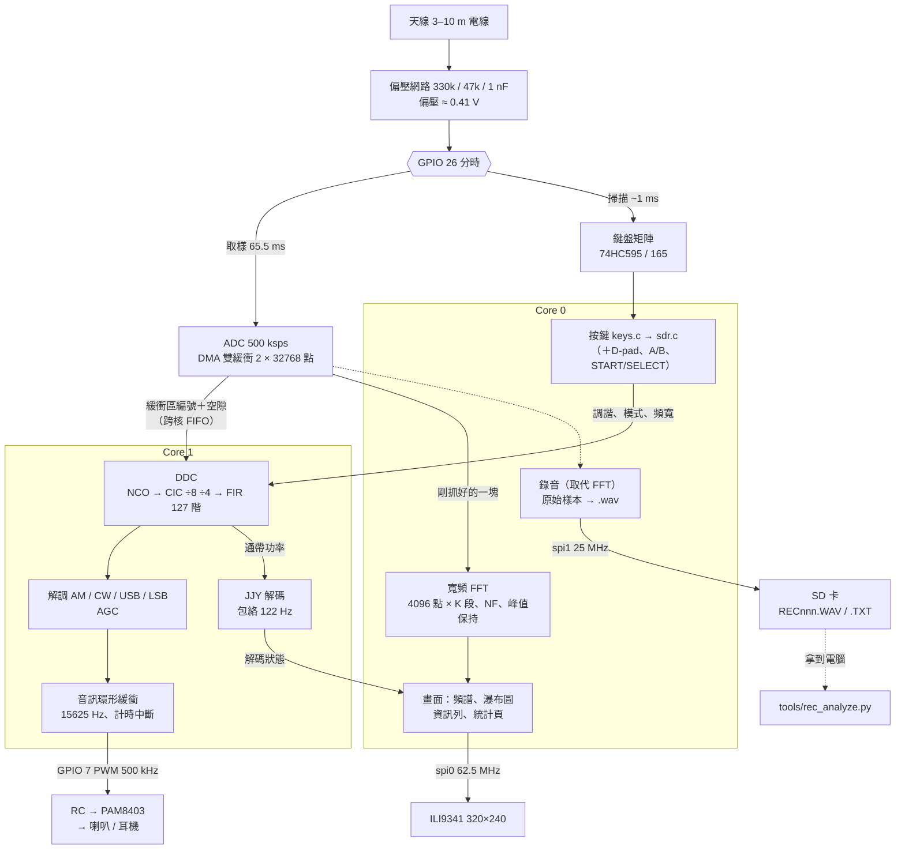

# rp2040-retro-sdr

RP2040 掌機上的 LF 直接取樣 SDR：0–250 kHz 的頻譜與瀑布圖，目標是喇叭出聲、
解 BPC／JJY 授時碼。

[rp2040-retro-handheld](https://github.com/pondahai/rp2040-retro-handheld)
生態系的一員。主板不用改，只在 GPIO 26 加 3 顆被動元件，鍵盤照常能用。
完整設計見 [docs/DESIGN.md](docs/DESIGN.md)，開發過程與實測數字見 [docs/DEVLOG.md](docs/DEVLOG.md)。

## 目前進度

| | 內容 | 狀態 |
| :--- | :--- | :--- |
| **M1** | ADC 取樣、寬頻 FFT、頻譜＋瀑布圖、鍵盤分時 | **已上機：每塊 60 ms、不掉塊** |
| **M2** | 窄頻 DDC、AM／CW／USB／LSB 解調、喇叭出聲 | **已上機：喇叭出聲、無斷音** |
| **M3** | BPC／JJY 解碼 | **JJY、BPC 解碼器都已上機，尚未收到真實訊號** |
| **M4** | SD 卡錄音、預設清單 | **錄音已實測：寫卡平均 26 ms、不掉塊**；預設清單已上機 |
| M5 | 封面、偏移編譯、收進 bundle | |

## 硬體：唯一要加的東西

```
3V3 ──[330k]──┬──[47k]── GND        偏壓 ≈ 0.41 V
              │
天線 ──||──────┴── GPIO 26（ADC0 ／ 74HC CLOCK）
      1nF
```

天線是 3–10 m 的電線，越長越好。為什麼偏壓是 0.41 V 而不是中點，見 DESIGN.md §1.1。

## 系統方塊圖



天線訊號和鍵盤時脈輪流用 GPIO 26：取樣一塊 65.5 ms，中間掃一次鍵盤約 1 ms。
同一塊樣本 Core 0 拿去做頻譜（錄音時改成寫進 SD 卡），Core 1 拿去解調出聲。
細節見 [DESIGN.md §2](docs/DESIGN.md)。

## 畫面與按鍵


上方是頻譜（青色＝平均、黃點＝峰值保持、紅線＝游標），中間是瀑布圖，
下方是游標讀數與雜訊底線（NF）。上圖是 `firmware/test_pc.c` 用合成訊號畫出來的：
40 kHz 與 68.5 kHz 兩個載波，加上 240 kHz 一根模擬的 PAM8403 尖峰。

| 按鍵 | 功能 |
| :--- | :--- |
| D-pad ← → ／ `h` `l`（`H` `L` 一次 10 步） | 調諧 |
| START ／ `s` | 調諧步進：10／100／1k／10k Hz |
| SELECT ／ `m` | 解調模式：AM → CW → USB → LSB |
| `b` | 通帶寬度（依模式） |
| A ／ B ／ `=` `-` | 音量 0–10 |
| D-pad ↑ ↓ ／ `k` `j` | 參考位準 ±5 dB |
| `]` `[` | 顯示範圍 ±20 dB |
| `a` | 平均檔位（1、2、4、4+指數、7+指數 段 FFT） |
| `p` | 峰值保持開關 |
| `0`–`9` `.` Enter | 直接輸入頻率（kHz，最多三位小數），Esc 取消 |
| `q` | QUIET：暫停 LCD 更新，用來比較 SPI 對雜訊底線的影響 |
| `t` | GPIO 0 輸出 68.5 kHz 測試訊號（杜邦線靠近天線） |
| `i` | 統計頁：耗時、時脈、雜訊底線、JJY 狀態（不插 USB 時看數字用） |
| `r` | SD 卡錄音開始／停止：寬頻原始樣本存成 `RECnnn.WAV`（500 ksps，最長 60 秒）＋`RECnnn.TXT` |
| `f` | 預設清單：切到下一個台（內建 JJY 40／60、BPC、測試訊號，加上 SD 卡的 `PRESETS.TXT`） |
| `F` | 把目前的頻率、模式、頻寬存進清單，並附加到 `PRESETS.TXT` |

鍵盤矩陣上已經沒有方向鍵（retro-dict 的 HANDOVER 有記載），所以方向靠 D-pad。

### 第一次上機要看的東西

資訊列第二行是處理統計：

- **PROC**：掃描＋DSP＋畫面一共花多久。超過 65 ms 就會掉塊。
- **DROP**：掉了幾塊。一直往上跳就按 SELECT 降低平均檔位。
- **SCAN**：鍵盤掃描造成的取樣空隙，預期約 1 ms。
- **NF**：每個 bin 的雜訊底線。沒接天線、接天線、按 `q` 前後，各記一次。

## 目錄

```
RetroSDR/          Arduino sketch：ADC、GPIO 26 分時、鍵盤掃描、LCD（硬體膠水）
  src/rs_*.c       一行的轉接檔，實際編譯的是 firmware/*.c
firmware/          純 C，PC 與板子共用
  fft.c            4096 點複數 FFT，int16 區塊浮點
  spectrum.c       去 DC、Hann 窗、多段平均、像素合併、雜訊底線
  wfall.c          瀑布圖環形緩衝與調色盤
  ddc.c            窄頻 DDC 與解調（Core 1）
  sdr.c            狀態機：按鍵、版面文字
  ui.c             逐列產生 RGB565
  font5x7.c        自繪的 5×7 ASCII 字型
  keys.c           鍵盤矩陣 -> 事件（取自 rp2040-retro-dict）
  wav.c            錄音檔的 .wav 檔頭
  preset.c         預設清單：內建的台、PRESETS.TXT 一行的解析與格式
  test_pc.c        PC 測試
loader_offset/     偏移編譯用（取自 rp2040-retro-dict）
tools/rec_analyze.py  分析錄音：最強訊號、頻譜圖、瀑布圖、輸出 I/Q wav（numpy＋Pillow）
docs/DESIGN.md     設計文件
```

## 編譯

**PC 測試**（需要 gcc，例如 WinLibs）：

```bat
firmware\build_pc.bat
```

會跑 dBFS 校正、雜訊底線、實景訊號、按鍵四組檢查，並輸出 `firmware/screen.ppm`。

**韌體**（需要 Arduino IDE 2 或 arduino-cli，加上 arduino-pico 核心）：

```bat
build_uf2.bat                  :: 一般版，連結在 0x10000000，直接 USB 燒錄
build_offset.bat               :: 偏移版，連結在 0x10004000，給 rp2040-retro-loader
```

偏移版的做法與 rp2040-retro-dict 相同，需要旁邊有 `rp2040-retro-loader` 才會產生
可以直接 USB 燒錄的 `_standalone.uf2`。

## 錄音與分析

插 SD 卡，調到想看的地方，按 `r` 開始、再按一次停止。把卡上的 `RECnnn.WAV` 與
`RECnnn.TXT` 複製到電腦：

```bat
python tools
ec_analyze.py REC000.WAV --lo 30000 --hi 50000 --iq 40000
```

## 預設清單

SD 卡根目錄的 `PRESETS.TXT`，一行一個台，可以在電腦上編輯，也可以在掌機上按 `F` 加：

```
# kHz  mode  bw(Hz)  name
40.000 CW 500 JJY Fukushima
26.000 AM 8000 1026 kHz alias
68.5 CW BPC
```

頻寬可以省略（用該模式的預設）。看不懂的行會跳過。第一次按 `f` 才讀檔；
沒插卡就只有內建的四個台。

## 授時碼記錄檔（JJY／BPC）

調諧點在 40 或 60 kHz（±500 Hz）時，自動把 JJY 的解碼狀態附加到 SD 卡的 `JJYLOG.TXT`；
在 68.5 kHz（±500 Hz）時則是 BPC，寫 `BPCLOG.TXT`（`F` 行改成 `cst=` 北京時間與 `date=`）。
每分鐘一行狀態（`S`），每解完一幀一行（`F`）。整晚放著收，隔天插卡看。
統計頁（`i`）第 10 行顯示有沒有在記。

```
# start up=00:01:12 tune=40000 mode=CW bw=500
S up=00:02:12 tune=40000 sig=-68.5 nf=-77 sn=8.5 span=9 sym=37 frames=0 good=0 err=0 hist=...
F up=00:03:01 tune=40000 sig=-63.2 nf=-77 err=0 good=1 jst=22:49 yday=282 year=26 wday=5 sym=M0010...
```

`up` 是開機後經過的時間（掌機沒有時鐘），`span` 是載波高低準位差（dB，不到 6 視為沒訊號），
`err` 的意義見 `firmware/jjy.h`／`firmware/bpc.h`。

## 授權

GPL-3.0。`keys.c`、`TFT_DMA.*`、`loader_offset/*.py` 取自
[rp2040-retro-dict](https://github.com/pondahai/rp2040-retro-dict)（同為 GPL-3.0）。
