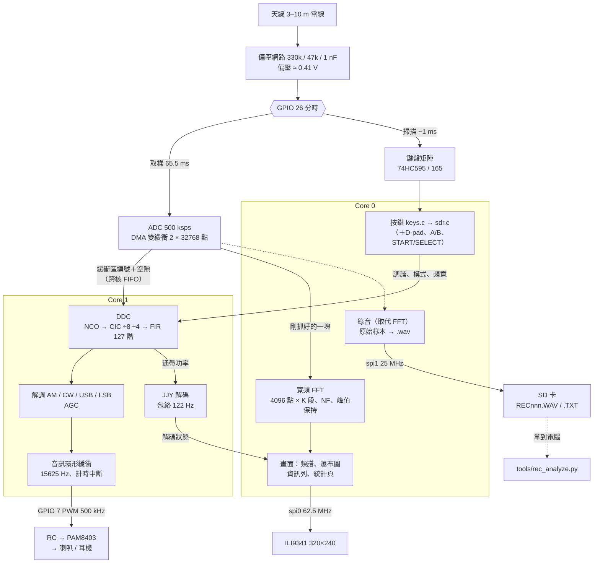

# rp2040-retro-sdr 設計文件

> 狀態（2026-10-10）：**M1–M4 已上機**
>
> | | 狀態 |
> | :--- | :--- |
> | M1 頻譜、瀑布圖、鍵盤分時 | 已上機：每塊 62 ms、不掉塊 |
> | M2 DDC、AM／CW／USB／LSB、喇叭 | 已上機：音訊 15625 Hz，Core 1 每塊 47 ms |
> | M3 JJY 解碼 | 已上機，**尚未收到真實訊號**；BPC 未做 |
> | M4 SD 卡錄音、預設清單 | 錄音已上機實測：寫卡平均 26 ms、不掉塊；預設清單已上機（`f`／`F`、`PRESETS.TXT`） |
> | M5 封面、收進 bundle | 未做 |
>
> 正文已依實作更新（2026-10-10）。和原始設計不同的地方就地註明「原設計」；
> 怎麼量到、為什麼改，見 [DEVLOG.md](DEVLOG.md)。
>
> 在 RP2040 掌機上做一台 LF 直接取樣 SDR：0–250 kHz 的頻譜與瀑布圖、
> 喇叭輸出解調後的聲音、BPC／JJY 授時碼解碼。
>
> 接腳以 [`rp2040-retro-handheld/docs/HARDWARE.md`](https://github.com/pondahai/rp2040-retro-handheld/blob/main/docs/HARDWARE.md)
> 為準；本文件只記錄 SDR 對那張表的**額外用法**。

---

## 0. 目標與非目標

**目標**

- 不改主板，只在 GPIO 26 外加 3 顆被動元件就能收訊
- 鍵盤矩陣照常可用（數字鍵輸入頻率）
- 喇叭出聲：AM／USB／LSB／CW 解調
- LCD 盡可能顯示：頻譜、瀑布圖、S 表、解碼結果
- 連結到 `0x10004000`，從載入器選單啟動

**非目標**

- 收人聲廣播：250 kHz 以下在台灣基本上沒有。那是之後 Tayloe 子板的事（見 §9）。
  原設計認為完全收不到；實際上中波電台會**混疊**進來（ADC 前沒有抗混疊濾波器），
  聽得到人聲與音樂，例如 1026 kHz → 26 kHz。「中波模式」已記下，暫不做
- 發射
- 透過 USB 把樣本串流到電腦

### 預期聽得到什麼

| 訊號 | 頻率 | 模式 | 聽起來 |
| :--- | :--- | :--- | :--- |
| BPC（中國商丘） | 68.5 kHz | CW | 每秒一次、長短不一的嗶聲 |
| JJY（日本） | 40 / 60 kHz | CW | 同上 |
| 海軍 VLF 台 | 15–30 kHz | — | MSK 數據，聽起來像嘶嘶聲 |
| 閃電 sferics | 3–10 kHz | AM 寬頻 | 劈啪聲，夏季傍晚多 |
| 中波電台（混疊） | f − k × 500 kHz | AM | 廣播節目；實測 1026 kHz 出現在 26.000 kHz |

收不收得到，取決於天線長度、時段和室內雜訊。實測（DEVLOG 2026-10-09、10-10）：
40.000 kHz 白天沒有訊號；60 kHz 附近有一根 59.998 kHz 的載波，還不確定是不是 JJY；
41–50 kHz 有一團本地干擾（嗡嗡聲）。

天線需要「地網」：用電池時掌機是浮接的，手摸地線或插上耳機（耳機線的地端）
訊號會明顯變好。接一條 2–5 m 的地網線是便宜的改善，尚未實測。

---

## 1. 硬體

### 1.1 天線輸入網路（唯一的外加零件）

```
3V3 ──[330k]──┬──[47k]── GND        偏壓 ≈ 0.41 V
              │
天線 ──||──────┴── GPIO 26（ADC0 ／ 74HC CLOCK）
      1nF
```

| 參數 | 值 | 理由 |
| :--- | :--- | :--- |
| 偏壓 | ≈ 0.41 V | 低於 74HC 在 3.3 V 時的 V<sub>IL</sub>（約 1.0 V），CLOCK 在取樣期間穩定在 LOW |
| 戴維寧等效 | ≈ 41 kΩ | 分壓電流約 9 µA；ADC 取樣電容的穩定時間遠小於 2 µs |
| 高通轉角 | ≈ 3.9 kHz | 1 nF × 41 kΩ；60 Hz 交流聲衰減約 36 dB，避免長天線把 CLOCK 拉過門檻 |
| 天線 | 3–10 m 電線 | 越長越好；室外優於室內 |

**為什麼不偏壓在中點 1.65 V？** 1.65 V 正好在 74HC 的切換門檻附近，595／165 會亂移位、
產生穿透電流，並把數位雜訊灌回訊號。天線訊號只有 µV–mV 等級，0.41 V 的餘裕綽綽有餘。

**為什麼不用 GPIO 27？** 它接 74HC165 的 QH，是一直在推動的推挽輸出。

### 1.2 對鍵盤掃描的影響

- GPIO 推 CLOCK 時，分壓電阻的負載可以忽略
- 天線加 1 nF 電容會讓邊緣變慢約 1 µs → **掃描時脈壓在 200 kHz 以下**
  （實作：每半週期 2 µs，約 125 kHz；CLOCK 驅動能力開到 12 mA；一次掃描約 0.96 ms）
- 掃描期間 CLOCK 的邊緣會從天線輻射出去；這段時間不取樣，所以不影響頻譜

### 1.3 已知的自我干擾

| 來源 | 頻率 | 處理 |
| :--- | :--- | :--- |
| 音訊 PWM 載波 | 500 kHz | 與取樣率相同 → 摺疊到 DC，被濾掉（§4.3） |
| PAM8403 開關頻率 | 約 250–300 kHz | 預期摺疊成固定的尖峰；尚未從頻譜上確認是哪一根 |
| ILI9341 SPI | 62.5 MHz 一帶 | 實測：按 `q` 停掉 LCD，雜訊底線與聲音都沒有可察覺的差別 |
| 筆電充電器（經 USB 地線） | 寬頻 | 實測：插著充電器 NF 約 -88 dBFS，拔掉約 -97 dBFS，差約 9 dB。收訊時拔掉 |
| 本地干擾（來源未查） | 41–50 kHz 一團，峰值 44.34 kHz | 解調是嗡嗡聲；沒有單一載波，不是中波格點 |
| 中波混疊 | 例：26.000 kHz（1026 kHz） | 不是自我干擾，但會在 LF 上冒出固定的載波；見 §0 |
| 其他固定的線（來源未查） | 61.4、90.85、94.0、150.0、152.0、181.0 kHz 等 | 錄音分析看到的，還沒追 |

---

## 2. 系統架構



實線是每一塊都會走的路；虛線的「錄音」只在按 `r` 之後取代寬頻 FFT。

### 2.1 核心分工

| | 工作 |
| :--- | :--- |
| **Core 0** | ADC DMA、寬頻 FFT、UI 與 LCD 繪製、鍵盤掃描、SD 卡錄音 |
| **Core 1** | DDC、解調、AGC、授時碼解碼、音訊 PWM 餵料（計時中斷也在 Core 1） |

Core 0 每抓完一塊，就把緩衝區編號（加上這一塊之前的掃描空隙點數）丟進跨核 FIFO。
那一塊要等下一塊抓完才會被 DMA 覆寫，Core 1 只要在 65 ms 內處理完就好；
兩邊都只讀樣本，不必複製。解碼狀態由 Core 1 寫、Core 0 只讀（畫面用）。
（原設計是兩個單向環形緩衝，另有窄頻 FFT 給 Core 0；窄頻 FFT 沒有做。）

### 2.2 時脈

| 時脈 | 來源 | 值 |
| :--- | :--- | :--- |
| clk_sys | PLL_SYS | **250 MHz**（原設計 125 MHz；M1 上機每塊 139 ms，超頻後才夠） |
| clk_peri | **clk_sys** | 250 MHz。arduino-pico 預設接在 48 MHz 的 USB PLL，SPI 最快只有 24 MHz；改接後 LCD 才有 62.5 MHz |
| clk_adc | PLL_USB | 48 MHz → ÷96 = **500 ksps** |
| 音訊 PWM | clk_sys | ÷ (wrap 499 + 1) = **500 kHz** |
| SD 卡 SPI（spi1） | clk_peri | ÷10 = 25 MHz |

兩個 PLL 都來自同一顆 12 MHz 石英，所以 ADC 取樣率和 PWM 頻率是**整數比鎖死的**。這是 §4.3 的前提；改 clk_sys 時，PWM 的 wrap 要跟著重算。

### 2.3 分時：ADC 取樣與鍵盤掃描輪流用 GPIO 26

```
|── ADC 取樣一塊 ──|掃描 ~1ms|── ADC 取樣一塊 ──|掃描|…
```

1. ADC 以 DMA 雙緩衝抓一整塊（N<sub>blk</sub> = 32768 點，65.5 ms）
2. 塊與塊之間：停 ADC → GPIO 26 切回 SIO 輸出 → 掃一次 8×8 矩陣（8 列 × 24 時脈，放慢後約 1 ms）→ 切回 ADC
3. 取樣期間 **LATCH（GPIO 14）保持不動**（停在高），595 的輸出凍結，鍵盤 LED 不會閃。
   LATCH 已確認是 595 的 RCLK 與 165 的 SH/LD 共用：PicoApple2 的 `scan_matrix()` 先拉高鎖存 595，
   再拉低 1 µs 讓 165 載入

| 影響 | 數值 | 評估 |
| :--- | :--- | :--- |
| 樣本損失 | 約 1.5% | 對寬頻 FFT 無影響；對每秒一個符號的授時碼無害 |
| 按鍵延遲 | 約 66 ms | 可接受 |
| 去彈跳 | `keys.c` 原封不動 | 30 ms 的門檻在 65 ms 的掃描週期下，本來就等於「連續兩次一致」 |

窄頻 DDC 不補零，改成**補相位**：本振的相位照真實時間轉過空隙（加上每塊開頭丟掉的
512 點偏壓暫態），載波在塊與塊之間就接得起來。原設計是補零，M2 上機有噠噠聲才改。
每塊實測週期 66.5 ms：取樣 65.5 ms ＋ 掃描約 0.96 ms，樣本損失約 1.5%。

---

## 3. 寬頻模式：0–250 kHz 全景

- 每塊丟掉開頭 512 點暫態，取 K 段、每段 4096 點，套 Hann 窗後做**實數 FFT**（2048 點複數 FFT＋拆分，
  int16 區塊浮點，M0+ 沒有 FPU），各段在 dB 域平均
- 平均檔位（鍵盤 `a`）：K = 1、2、4、4＋指數平均、7＋指數平均；預設 4 段。7 段時 Core 0 超過 65 ms，會掉塊
- bin 寬 = 500k / 4096 ≈ **122 Hz**，2048 個 bin → 每個像素合併 6–7 個 bin 取最大值（窄載波才不會被平均掉）
- 雜訊底線 NF = 所有 bin 的中位數；另外做峰值保持
- 輸出：320 點的 dB 值 → 頻譜曲線＋一列瀑布圖
- 實測：4 段時 FFT 25 ms、整段 DSP 37 ms

### 3.1 SIG、NF、S/N 怎麼算

都從這張寬頻頻譜算，不是從 DDC（聽到的聲音）算。

| | 算法 |
| :--- | :--- |
| **dBFS** | 振幅 2048 的正弦（ADC 0–4095 擺滿）落在 bin 正中央 = 0 dBFS（PC 測試 [1]，±0.3 dB） |
| **SIG** | 調諧點所在的 bin 與左右各一格，三格的最大值（載波不一定在 bin 中央） |
| **NF** | bin 4–2047（約 0.5–250 kHz）的**中位數**；bin 0–3 是 DC 與窗的殘渣。中位數不會被少數幾根強訊號拉高 |
| **S/N** | SIG − NF |

要注意：

1. **這是每個 bin（122 Hz）的 S/N，不是通帶內的。** AM 8 kHz 通帶約 65 個 bin，耳朵聽到的雜訊
   大約多 18 dB：畫面 S/N 10 dB 的 AM 電台聽起來比 10 dB 吵很多。CW 500 Hz（約 4 個 bin）比較接近。
2. **NF 是整個 0–250 kHz 的中位數，不是調諧點附近的雜訊。** 調諧點落在雜訊隆起處（例如 41–50、
   50–110 kHz）時，S/N 會偏樂觀。
3. **NF 只有 1 dB 解析度**：中位數用 1 dB 一格的直方圖求（M0+ 排序 2048 個值太慢），所以 NF 總是整數。
   SIG 是 0.1 dB。
4. **dB 域平均讓雜訊讀數偏低約 2.5 dB**（隨機起伏的功率先取對數再平均），穩定的載波不受影響，
   所以 S/N 偏高約 2.5 dB。偏差固定，拿來比較前後差異（例如有沒有接地網）不受影響；絕對值不要拿去和別的設備比。

想要貼近耳朵感受的數字，要改量「通帶內功率」對「通帶外附近的雜訊」，也就是 §7 的 S 表（未做）。

---

## 4. 窄頻模式：DDC、解調、音訊

### 4.1 訊號鏈

```
ADC 500k ─→ NCO 混頻 ─→ CIC³ ÷8 ─→ CIC³ ÷4 ─→ FIR 127 階 ─→ 15625 Hz I/Q ─→ 解調 ─→ AGC ─→ 音訊
 (uint16)   (查表 sin/cos) int32      int64       通道濾波                          └→ 包絡（JJY）
```

- **NCO**：32 位元相位累加器，1024 點 sin 查表（q10），頻率解析度 500k / 2³² ≈ 0.0001 Hz
- **CIC**：3 階，拆兩級。第一級 ÷8 跑在 500 kHz，int32 就裝得下；第二級 ÷4 跑在 62.5 kHz，用 int64。
  單級 ÷32 要 int64 積分器，M0+ 暫存器不夠，實測慢很多。兩級串接的響應與單級完全相同
- **FIR**：127 階對稱，Hamming 窗 sinc，係數 q15。摺疊後乘法減半，樣本拆高低 16 位元各乘一次，不用 64 位元乘法，結果與直接乘逐位元相同
- **音訊取樣率 15625 Hz**：一塊 32768 點剛好 1024 個音訊樣本。原設計是 8 kHz，第一版做成 ÷64（7812.5 Hz）。
  上機聽起來比電腦上解調同一段錄音悶：AM 只到 3 kHz，而且 CIC 的第一個零點在 7812.5 Hz，3 kHz 已經掉 6.7 dB。
  改成 ÷32 之後零點在 15625 Hz，3 kHz 只掉 1.6 dB。FIR 沒有做 CIC 補償
- **運算**：實測 Core 1 每塊 47 ms（FIR＋解調 31 ms、混頻＋CIC 16 ms），預算 65 ms
- **窄頻 FFT**（原設計，給窄頻顯示用）：沒有做

### 4.2 解調

| 模式 | 做法 | 通帶預設 |
| :--- | :--- | :--- |
| AM | √(I² + Q²)，去 DC（τ ≈ 64 ms） | 8 kHz（可選 8000／6000／4000） |
| USB / LSB | 本振偏到通帶中心，低通濾波後再用 BFO 搬回音訊取實部；LSB 先取共軛 | 2.4 kHz（1800／2400／2700） |
| CW | 本振在調諧點，乘 e^{+j2π·800t} 取實部 → 800 Hz 嗶聲 | 500 Hz（250／500／1000） |

USB／LSB 原設計是 Weaver 或 Hilbert；實作的做法等同 Weaver（本振＋低通＋BFO）。
FIR 在 15625 Hz 下過渡帶約 400 Hz，CW 250 Hz 這一檔實際會寬一些。

**AGC**

- **AM 依載波定增益**：增益 = 目標 ÷ 載波（`am_dc`，有下限），再加一個只在快削頂時才動作的限幅器。
  載波不隨節目內容變，字與字之間的停頓不會被拉高，調變的大小聲原樣保留。
  原本用峰值 AGC，峰值／均方根只有 3.6（電腦參考 6.0），改後 6.2。
  代價：沒電台的頻率雜訊和電台音量差不多（AM 沒有載波時雜訊等於 100% 調變）
- **CW／SSB 用峰值追蹤**：attack 快、decay 慢（約 0.5 s），包絡有下限，沒訊號時不會把雜訊放到滿

### 4.3 音訊輸出（GPIO 7 → PAM8403）

- PWM 頻率 = **500 kHz，與 ADC 同步** → PWM 載波經 500 ksps 取樣後摺疊到 0 Hz，被 DDC 和寬頻 FFT 的去 DC 處理掉
- wrap 499 → 解析度約 9 位元
- 15625 Hz 音訊以零階保持升頻，由 Core 1 的計時中斷每 64 µs 餵一次 PWM duty。
  產出是每塊一次倒進約 1008 個、略少於播放速度（掃描空隙），所以依環形緩衝（4096）的水位
  在 63／64／68 µs 之間微調，水位停在約 1536–2560（約 0.1 s 延遲）
- RC 低通沿用主板現有的設計
- **音質的瓶頸在喇叭**：同一個訊號用耳機聽比 PAM8403＋小喇叭清楚很多（使用者實測）

---

## 5. 授時碼解碼

BPC 和 JJY 都是**每秒一個符號、以載波功率變化編碼**：

| | 編碼 | 一幀 |
| :--- | :--- | :--- |
| JJY | 載波 100% 持續 0.8／0.5／0.2 s → 0／1／標記 | 60 s |
| BPC | 載波降低 0.1／0.2／0.3／0.4 s → 2 位元一個符號，另有幀首 | 20 s |

流程（JJY 已實作，`firmware/jjy.c`）：

1. DDC 的通帶功率包絡（AGC 之前），每 128 個音訊樣本一點 ≈ 122 Hz，附真實時間戳（ms，把掃描空隙算進去）
2. 高、低準位追蹤（dB），取中間當門檻 → 二值化；邊緣要維持 80 ms 才算數
3. 每秒的上升邊緣是秒的開頭 → 量到下降的寬度 → 0.8／0.5／0.2 s 分成 0／1／標記
4. P0 緊接 M = 一分鐘的開頭 → 收滿 60 個 → 檢查標記位置、固定為 0 的位元、同位位元、數值範圍
5. 連續兩幀都解成功、而且第二幀剛好是第一幀加一分鐘，才算「鎖定」

調諧點在 40 或 60 kHz ±500 Hz 時，資訊列改顯示解碼狀態與最近的符號。
PC 測試三層都過（格式、雜訊包絡、40 kHz 載波經 DDC 端到端）；**上機還沒收到真實訊號**。

**BPC 還沒做**：格式不同（20 秒一幀、四進位），完整格式要以官方規格為準，上表只是用來估算工作量。

---

## 6. 輸入

- 直接沿用 `rp2040-retro-dict/firmware/keys.c`：輸入 8 byte 的 bit mask，輸出按鍵事件
- 去彈跳不用改：`keys.c` 要求狀態穩定 30 ms，在約 66 ms 的掃描週期下就是「連續兩次一致」，按鍵延遲約 130 ms
- 連發：400 ms 起跳，間隔實際上被掃描週期限制在約 66 ms
- **鍵盤矩陣上已經沒有方向鍵**（rp2040-retro-dict 記載），方向一律走 D-pad

實際的按鍵（完整表與說明見 README）：

| 按鍵 | 功能 |
| :--- | :--- |
| `0`–`9`、`.`、Enter／Esc | 輸入頻率（kHz）／取消 |
| D-pad ← →、`h` `l`（`H` `L` 一次 10 步） | 調諧 |
| START、`s` | 調諧步進 10／100／1k／10k Hz |
| SELECT、`m` | 解調模式 AM → CW → USB → LSB |
| `b` | 通帶寬度 |
| A／B、`=` `-` | 音量 |
| D-pad ↑ ↓、`k` `j`；`]` `[` | 參考位準；顯示範圍 |
| `a`、`p` | 平均檔位；峰值保持 |
| `q`、`t`、`i` | 暫停 LCD；GPIO 0 測試訊號；統計頁 |
| `r` | SD 卡錄音開始／停止 |
| `f`、`F` | 預設清單：下一個台；把目前的台存進清單與 `PRESETS.TXT` |

原設計的預設清單是 `P`，但 `P` 已經給了峰值保持，改成 `f`（favorites）。
原設計還有 `W`（寬頻／窄頻切換），還沒做：頻譜一直是 0–250 kHz 全景。

---

## 7. 顯示（ILI9341 320×240 橫向）

```
┌────────────────────────────────────────┐
│ CW  68.500 kHz  BW 500 STEP 100 VOL 5 REC│ y 0–15    狀態列（右上：REC > QUIET > PK）
├────────────────────────────────────────┤
│     頻譜曲線（平均＋峰值保持）           │ y 16–95   頻譜（80 px），0–250 kHz
│   ░░░▓▓█▓░░        ↓調諧游標            │
├────────────────────────────────────────┤
│                                        │
│     瀑布圖（按 i 換成統計頁）           │ y 96–191  瀑布圖（96 px）
│                                        │
├────────────────────────────────────────┤
│ SIG -63.2 dBFS  S/N 14.1 dB    NF -77.3 │ y 192–223 資訊列：游標讀數
│ 錄音狀態 > JJY 解碼 > REF/RNG/PROC/DROP  │           第二行依優先序
├────────────────────────────────────────┤
│ PAD <>TUNE ^vREF  A/B VOL  SEL MODE ...  │ y 224–239 按鍵提示
└────────────────────────────────────────┘
```

- **頻譜**：0–250 kHz 全景，紅線是調諧游標。原設計的窄頻顯示（調諧點 ±通帶 × 2.5）、通帶陰影、已知雜訊標記都還沒做
- **瀑布圖**：RAM 裡存 320×96 的 8 位元調色盤索引環形緩衝（30 KB），每幀以 SPI DMA 重畫
  - 不用 ILI9341 硬體捲動：它只沿長軸捲，橫向畫面下瀑布圖會變成左右流動
  - 調色盤：黑 → 藍 → 青 → 黃 → 紅 → 白，256 階預先轉成 RGB565
- **資訊列**：第一行是調諧點 ±1 bin 的強度、S/N（對 NF）與 NF，算法與限制見 §3.1。第二行依序顯示：頻率輸入中、
  錄音狀態、JJY 解碼（調在 40／60 kHz 時）、處理統計。原設計的 S 表與音訊波形沒有做
- **統計頁**（`i`）：兩顆核心的耗時、掉塊、音訊水位、時脈、NF、S/N、JJY 狀態。拔掉 USB 收訊時看數字用
- **更新率**：每塊（66.5 ms）一列瀑布圖、一次重畫；錄音時每秒一次

---

## 8. 資源預算

### 記憶體（264 KB SRAM）

| 項目 | 大小 |
| :--- | ---: |
| ADC 雙緩衝 2 × 32768 × int16 | 128 KB |
| 瀑布圖環形緩衝 | 30 KB |
| FFT 工作區＋窗函數＋調色盤 | 約 20 KB |
| DDC／解調／音訊緩衝（音訊環形緩衝 4096 × int16 = 8 KB） | 約 14 KB |
| SdFat＋錄音時間戳（916 × 4 B） | 約 6 KB |
| 堆疊、其他 | 約 16 KB |
| **設計估計** | **約 214 KB** |
| **實測：全域變數**（arduino-cli 回報） | **242.6 KB（92%），剩 19.5 KB** |

實測比估計多約 28 KB，還沒細查是哪些（arduino-pico 核心、USB 序列埠、統計頁字串等都有份）。

若太緊，第一個可以砍的是 ADC 緩衝：改成 2 × 16384，按鍵延遲降到約 33 ms，樣本損失升到約 2%。

### CPU（250 MHz，每塊 65.5 ms）

| | 原設計估計（125 MHz） | 實測（250 MHz） |
| :--- | :--- | :--- |
| Core 1：DDC＋解調＋音訊 | 約 25% | 每塊 47 ms（72%） |
| Core 0：鍵盤掃描 | — | 約 0.96 ms |
| Core 0：FFT 等（4 段平均） | 約 30% | 每塊 37 ms（FFT 25 ms） |
| Core 0：LCD 重畫 | CPU 約 10% | 每塊 23 ms（產生每列 13 ms、等 SPI 10 ms） |
| Core 0：合計 | | **62 ms，不掉塊** |

原設計是 125 MHz，不夠再超頻；M1 上機每塊 139 ms，已超頻到 250 MHz（PWM wrap 跟著改 499）。
錄音時 Core 0 不做 FFT、畫面每秒一次，改成寫卡（64 KB 平均 26 ms）。
兩顆核心都沒剩多少：Core 1 約 18 ms、Core 0 約 3 ms。

---

## 9. 未來：Tayloe 子板

這份設計刻意讓 DSP 和 UI 與前端無關。之後若加 Pi Pico Rx 那種 Tayloe QSD 子板：

- I／Q 進 ADC，PIO 在 GPIO 0／1 產生正交本振
- 本文件的 §4（DDC 之後）、§6、§7 幾乎不用改
- 收訊範圍擴大到約 30 MHz → 這時才聽得到人聲短波廣播

這也是不直接用 USB 串流到電腦的原因：要讓掌機自己就是一台完整的收音機。

---

## 10. 里程碑

| | 內容 | 完成的判準 |
| :--- | :--- | :--- |
| **M1** | ADC 取樣、寬頻 FFT、頻譜＋瀑布圖、鍵盤分時 | 能看到實機雜訊底線；按鍵正常；鍵盤 LED 不閃 |
| **M2** | 窄頻 DDC、CW／AM 解調、喇叭出聲 | 用訊號產生器或 PIO 自發 68.5 kHz 測試音，喇叭聽得到 |
| **M3** | BPC／JJY 解碼 | 收到真實訊號並連續兩幀一致 |
| **M4** | SD 卡錄音（`.wav`）、預設清單 | 錄下的檔案能在電腦上用 SDR 軟體開啟 |
| **M5** | 封面（依 `ICON-STYLE.md`）、連結到 `0x10004000`、收進 bundle | 從載入器選單啟動 |
| ~~**文件**~~ | **已完成**（§2、README）。繪製本系統的方塊圖：天線／偏壓網路 → GPIO 26 分時（ADC／鍵盤）→ Core 0（FFT、畫面）與 Core 1（DDC、解調、JJY）→ LCD／喇叭 | 放進 README 與本文件，看圖就懂訊號與資料怎麼流 |

M2 的測試訊號可以由掌機自己產生：在閒置的 GPIO 0 輸出 68.5 kHz 方波，旁邊繞一圈線當作「發射天線」。不必有外部儀器就能驗證整條訊號鏈。
實作是用 PWM（鍵盤 `t`，68493 Hz），不是 PIO；杜邦線靠近天線時 S/N 約 10 dB。

M4 的判準已達成：錄下的 .wav 是 500 ksps 原始樣本，`tools/rec_analyze.py` 可以分析，
並輸出 SDR++／SDR# 能直接開的 I/Q wav。

---

## 11. 待確認

1. ~~**LATCH 的接法**~~：**已確認共用**（見 §2.3）
2. ~~**GPIO 26 飛線位置**~~：**已焊好**（330k／47k／1 nF＋天線），鍵盤正常
3. **PWM 與 RC 濾波器的參數**：主板現有 RC 低通的轉角頻率，決定 500 kHz 載波在 PAM8403 輸入端剩下多少
4. **PAM8403 的實際開關頻率**：決定 §1.3 那根尖峰的位置
5. **BPC 格式**：§5 的表要以官方規格校正
6. ~~**CLOCK 慢邊緣會不會讓 74HC595 多吃時脈**~~：放慢時脈並開 12 mA 驅動之後，焊上偏壓網路與天線，鍵盤正常
7. ~~**CPU 是否夠用**~~：超頻到 250 MHz 等優化後，4 段 FFT 每塊 62 ms、不掉塊（§8）
8. **天線地網**：手摸地線或插耳機收訊明顯變好；接一條地網線的效果待測（§0）
9. **41–50 kHz 本地干擾的來源**（§1.3）
10. **S 表（未做）**：現在的 S/N 是每個 bin 對全頻段中位數（§3.1），和耳朵聽到的不一樣。
    改成通帶內功率（DDC 已經在算 `level`，JJY 的包絡也是）對通帶兩側附近的雜訊，
    在資訊列或狀態列畫成一條 S 表。工作量主要在畫面；要先決定「通帶外附近」取多寬
